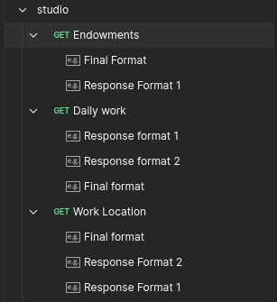

# Studio Backend

## Getting Started

### Bootstrap the Project

1. **Clone the Repository**

   ```sh
   git clone https://github.com/iamprogrammer04/studio.git
   cd studio
   ```

2. **Install Dependencies**

   ```sh
   npm install
   ```

3. **Environment Variables**

   - A `.env` file has been purposefully inserted with the database URL so you can check the data directly or replace it with your localhost URL if needed.

4. **Start the Server**

   ```sh
   npm run start
   ```

## API Endpoints

- `GET /scores/work` - Fetch work scores
- `GET /scores/location` - Fetch location scores
- `GET /scores/endowment` - Fetch endowment scores

## API Testing

A Postman collection has been added for API testing. You can import it into Postman to test the available endpoints easily. Each request has a saved response so you can check different kinds of responses.



## Additional Notes

While testing different response formats, I created a static file that includes names as represented in the graph. These names have been mapped to their corresponding indexes as explained in the video. After retrieving user data, I mapped these names to the `score` column for improved readability and better visibility of the data.
